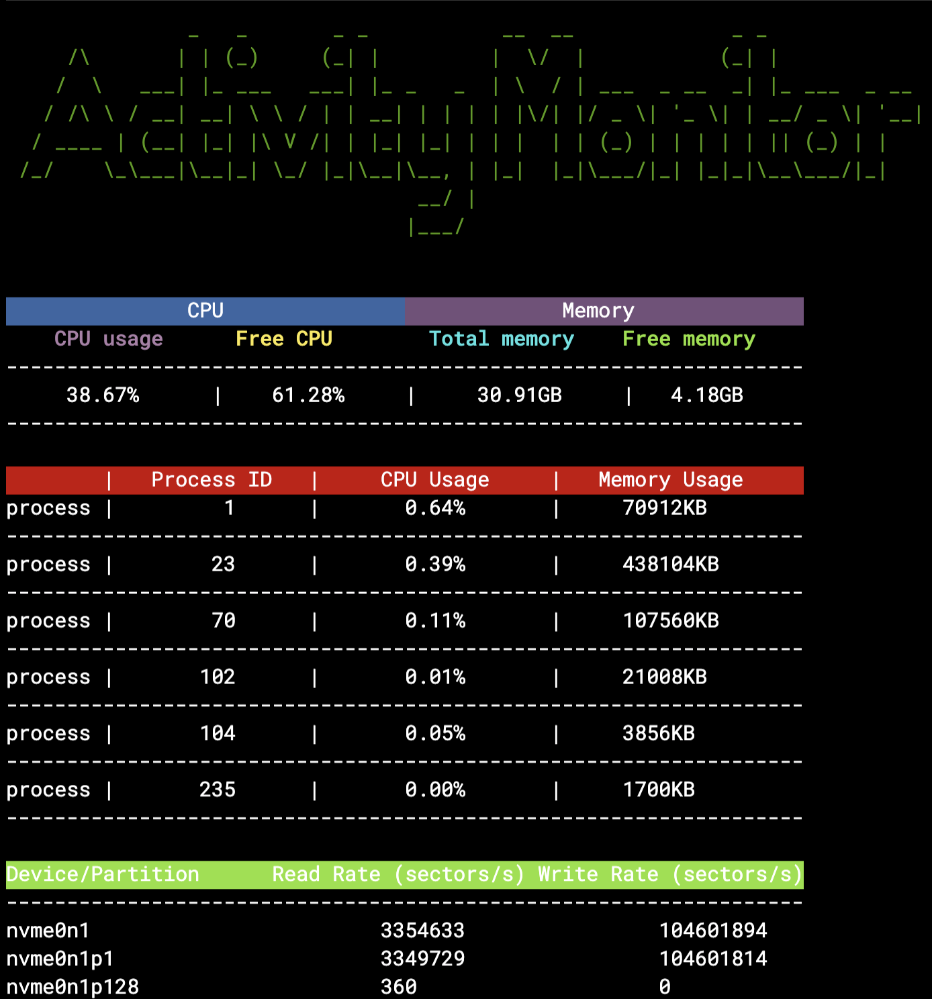

# System-Activity-Monitor


# System Activity Monitor

The System Activity Monitor is a simple utility that collects and displays various system statistics in real-time. It provides insights into CPU usage, memory usage, and disk activity, along with the ability to filter the output by application/process names.

## Features

- Real-time display of system statistics
- Refresh rate of 1-5 seconds
- Search functionality to filter output by application/process name

  ## Stats Collected

### CPU Stats

- Overall CPU usage: The overall usage percentage of the CPU
- Overall CPU free: The percentage of CPU that is idle or free
- CPU usage per application/process: The usage percentage of CPU for each individual application/process

### Memory Stats

- Total memory: The total amount of system memory
- Free memory: The amount of free memory available
- Memory usage per application/process: The memory usage for each individual application/process

### Disk Stats

- Devices and partitions: The list of disk devices and partitions
- Read rate: The rate of data read from the disk (sectors/s)
- Write rate: The rate of data written to the disk (sectors/s)

## **Definitions**

- **CPU Usage**: The percentage of time the CPU is actively executing tasks compared to the total time.
- **Memory Usage**: The amount of memory utilized by the system and individual processes.
- **Disk Activity**: The rate at which data is read from or written to the disk.

## Requirements

- GCC (GNU Compiler Collection)

## Build and Run

Follow these steps to build and run the System Activity Monitor:

1. Clone the repository:

```bash
git clone https://github.com/anassajaanan/System-Activity-Monitor.git
```

1. Change into the cloned directory:

```bash
cd System-Activity-Monitor
```

1. Build the program using the provided Makefile:

```bash
make
```

1. Run the system_monitor program:

```bash
./system_monitor
```

1. The program will display the system stats in real-time with the specified refresh rate. You can use the search functionality to filter the output by entering an application/process name.

## Clean Up

To remove the built binary, run the following command:

```bash
make clean
```

## License

This project is licensed under the [MIT License]().
